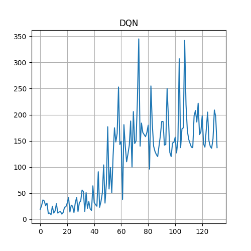
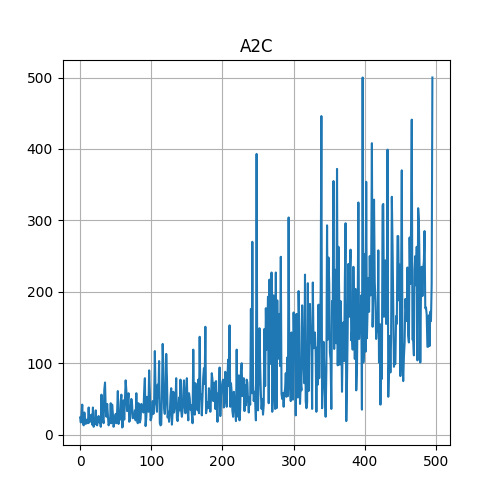
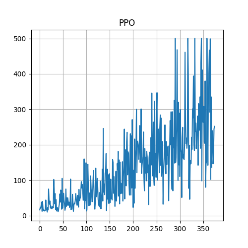
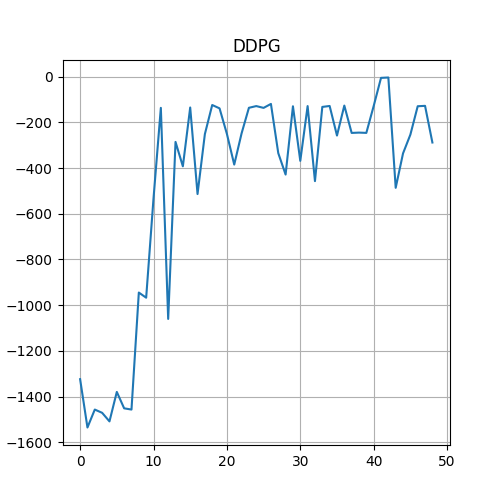
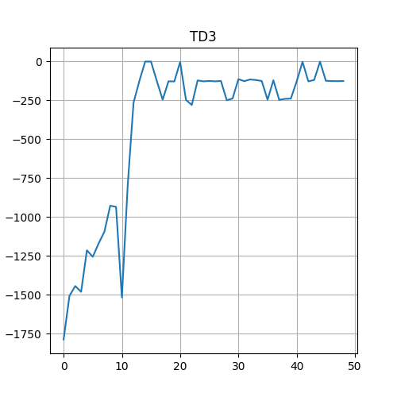
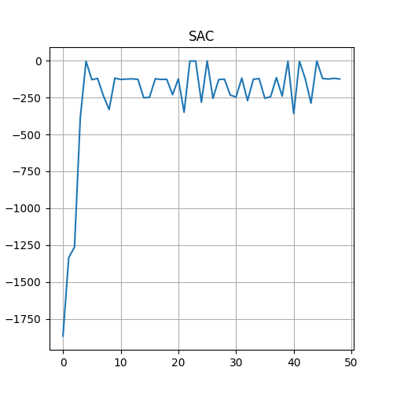

# Deep reinforcement learning in PyTorch

This repo provides straightforward implementations of common DRL algorithms.

Algorithm list:
- DQN: Deep-Q-network
- PG: Policy gradient algorithm
- A2C: Advantage actor critic
- PPO: Proximal policy optimisation
- DDPG: Deep deterministic policy gradient
- TD3: Twin-delayed-DDPG
- SAC: Soft actor critic

The document [IntroToDRL.pdf](IntroToDRL.pdf) provides an introduction to deep reinforcement learning and the important formulas behind the algorithms.

**Training Rewards**

CartPole | CartPole
:---: | :---:
 | 

CartPole | CartPole
:---: | :---:
 | 

Pendulum | Pendulum | Pendulum
:---: | :---: | :---:
 |  | 

## Structure

The `single_file/` folder contains files with working examples of each algorithm.
The `modular/` folder contains the same algorithms, but split into their modular.

